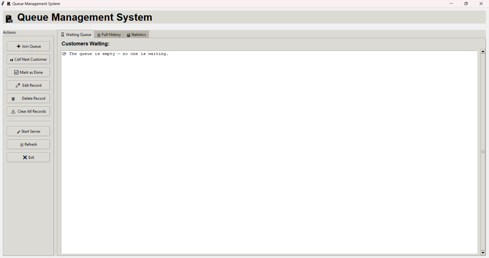

# ℹ️ *Personal Information*
 * Name: *Jex D. Malibiran*
 * Location: *Palawan, Philippines*
 * Course / Section: BSIT

   ## **About Me**
   
   > Hello! I am a Bachelor Of Science and Information Technology student. This is my portfolio for **CPROG-2** and this is also my documentation to my project related to programming and technology.

## 💼 **Skills**

 
  
* **Basic Programming**
* **Problem-solving**
* **Team Collaboration**
* **Critical Thinking**

  
## 🧑‍💻 **Technologies**

 
  
* **CSS/Python**
* **Microsoft 365**
* **Canva**
* **Microsoft Teams**
  

# **Projects**

 
   
### Queue Management System

A queue management system project.

- Repo: https://github.com/daylighttg/IT1C_PythonProject_QUEUING

